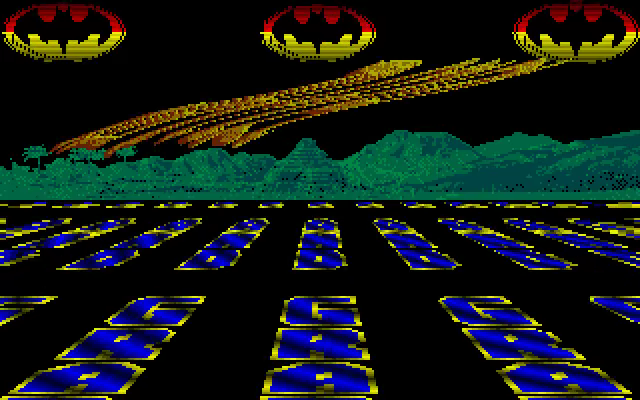
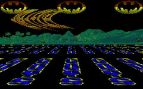

# Larcociel 5 Go

A Go/Ebitengine conversion of **DMA Intro 5**, an Atari ST intro by
**Larcociel of DMA**, using Demo Construction Kit **v1.0.13**.

<!-- Project showcase -->
## Screenshots

[](docs/media/screenshot-1.png)

Batman music meters, a moving ribbon, and scrolltext receding into a perspective floor.

## Video

[](https://github.com/olivierh59500/go-larcociel5/raw/refs/heads/main/docs/media/preview.mp4)

**[Watch or download the 24-second MP4 preview with sound](https://github.com/olivierh59500/go-larcociel5/raw/refs/heads/main/docs/media/preview.mp4)**

This preview is captured from the Go production.

The animated image is silent; the MP4 includes the soundtrack.

<!-- End project showcase -->

## Production notes

```sh
go run ./cmd/larcociel5
go run ./cmd/larcociel5 -mute
```

Space or Escape closes the intro. The 320 × 200 scene advances at 50 Hz and
combines three Batman music meters, a moving row-deformed ribbon, an illustrated
landscape and a color scrolltext receding into a perspective floor.

The native artwork, font colors, message, acceleration program and fifty-line
ribbon history are retained. The movement test compares a 149-frame 68000
checkpoint, including the complete row history and motion counters. DCK owns
the retained row/sprite batches, literal scrolling layout and YM playback.
The palette scroller samples DCK's bounded glyph window, then uploads only a
16 × 100 color bank using the original integer perspective recurrence.
The fixed indexed floor supplies the projected column outlines. Drawing uses
no GPU pixel readback; the original YM6 soundtrack is embedded.

```sh
go test ./internal/source
go vet ./...
go run ./cmd/larcociel5 -capture captures/preview -frame 800 -frames 1
go run ./cmd/video
```

DCK's video exporter writes a three-minute H.264/AAC MP4, a PNG poster and a
JSON report to `recordings/`, at 640 × 400 and 50 fps. The website uses a
VP9/Opus WebM copy. Graphics and music share one simulation clock.

Original production: [Demozoo](https://demozoo.org/productions/79464/).

## Android

```sh
./scripts/run-android.sh --build-only
./scripts/run-android.sh
```

The build uses Java 17, Android SDK 36, NDK 28.2, Ebitengine 2.9.11 and the
included Gradle wrapper. It produces an ARM64 APK in
`android/app/build/outputs/apk/debug/app-debug.apk`. The host initializes Go
rendering and audio after the Android context is available, preserves landscape
orientation and keeps the screen awake. Android Back closes the activity.
The install command requires one authorized USB device; `ANDROID_SERIAL`
can select a specific device. Build products and machine settings stay local.
